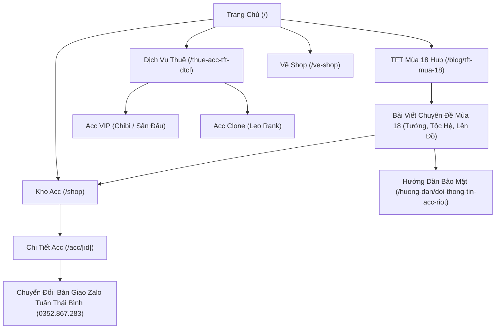

# SEO RELEASE BASELINE & TECHNICAL AUDIT REPORT

- **Website**: [https://www.shoptftmobile.net](https://www.shoptftmobile.net)
- **Release Date**: 03/10/2026 (Phase 13 Final SEO Release)
- **Target Freeze Window**: 2–4 tuần (Tuyệt đối không đổi Title/Slug/Structure trong giai đoạn này)
- **Audit Tooling**: Automated SEO Health Monitor + Local & Production Endpoint Verification

---

## 1. Core URL Audit & Status Baseline

| Đường Dẫn (Path) | HTTP Status | Tiêu Đề (Title) | Độ Dài | H1 Tag | Canonical | Robots Tag |
| :--- | :---: | :--- | :---: | :--- | :--- | :--- |
| `/` | 200 OK | Thuê Acc TFT - ĐTCL \| Pet, Chibi & Sân Đấu \| ShopTFTMobile | 59 ký tự | TÌM ĐÚNG ACC TFT - ĐTCL BẠN MUỐN | https://www.shoptftmobile.net | index, follow |
| `/shop` | 200 OK | Kho Acc TFT - ĐTCL \| ShopTFTMobile | 35 ký tự | Kho Acc TFT - ĐTCL | https://www.shoptftmobile.net/shop | index, follow |
| `/thue-acc-tft-dtcl` | 200 OK | Thuê Acc TFT - ĐTCL: Pet, Chibi & Sân Đấu \| ShopTFTMobile | 57 ký tự | Thuê Acc TFT - ĐTCL Theo Đúng Nhu Cầu | https://www.shoptftmobile.net/thue-acc-tft-dtcl | index, follow |
| `/ve-shop` | 200 OK | Về ShopTFTMobile & Tuấn Thái Bình TFT \| Uy Tín & Trách Nhiệm | 60 ký tự | Về ShopTFTMobile | https://www.shoptftmobile.net/ve-shop | index, follow |
| `/huong-dan` | 200 OK | Hướng Dẫn Dịch Vụ TFT & Riot Games \| ShopTFTMobile | 50 ký tự | Hướng Dẫn Dịch Vụ TFT & Riot Games | https://www.shoptftmobile.net/huong-dan | index, follow |
| `/huong-dan/doi-thong-tin-acc-riot` | 200 OK | Hướng Dẫn Đổi Thông Tin Acc Riot An Toàn \| ShopTFTMobile | 55 ký tự | Hướng Dẫn Đổi Thông Tin Acc Riot Games | https://www.shoptftmobile.net/huong-dan/doi-thong-tin-acc-riot | index, follow |
| `/blog` | 200 OK | Blog TFT Mùa 18 & Cẩm Nang ĐTCL \| ShopTFTMobile | 46 ký tự | Blog TFT Mùa 18 – Kiến Thức & Meta ĐTCL Uy Tín | https://www.shoptftmobile.net/blog | index, follow |
| `/blog/tft-mua-18` | 200 OK | TFT Mùa 18 – Hướng Dẫn, Meta, Pet & Sân Đấu \| ShopTFTMobile | 58 ký tự | TFT Mùa 18 – Hướng Dẫn, Meta, Pet & Sân Đấu | https://www.shoptftmobile.net/blog/tft-mua-18 | index, follow |
| `/blog/tong-hop-tuong-5-vang-va-cach-kich-hoat-tft-mua-18` | 200 OK | Tổng Hợp Tướng 5 Vàng TFT Mùa 18 & Cách Đánh Fast 9 \| ShopTFTMobile | 67 ký tự | Tổng Hợp Tướng 5 Vàng TFT Mùa 18 & Cách Xoay Bài Fast 9 Cuối Trận | https://www.shoptftmobile.net/blog/tong-hop-tuong-5-vang-va-cach-kich-hoat-tft-mua-18 | index, follow |
| `/blog/danh-sach-tuong-4-vang-carry-manh-tft-mua-18` | 200 OK | Danh Sách Tướng 4 Vàng Carry Mạnh Nhất TFT Mùa 18 \| ShopTFTMobile | 65 ký tự | Danh Sách Tướng 4 Vàng Carry Mạnh Nhất TFT Mùa 18 Bạn Phải Biết | https://www.shoptftmobile.net/blog/danh-sach-tuong-4-vang-carry-manh-tft-mua-18 | index, follow |
| `/blog/san-dau-moi-va-hieu-ung-am-nhac-tft-mua-18` | 200 OK | Khám Phá Sân Đấu Mới Đổi Nhạc TFT Mùa 18 \| ShopTFTMobile | 56 ký tự | Khám Phá Sân Đấu Mới & Hiệu Ứng Âm Nhạc Sống Động TFT Mùa 18 | https://www.shoptftmobile.net/blog/san-dau-moi-va-hieu-ung-am-nhac-tft-mua-18 | index, follow |
| `/acc/748` | 200 OK | Gwen Hồng Pha Lê + Irelia Sứ Thanh Hoa \| Acc TFT - ShopTFTMobile | 64 ký tự | Gwen Hồng Pha Lê + Irelia Sứ Thanh Hoa | https://www.shoptftmobile.net/acc/748 | index, follow |
| `/acc/776` | 200 OK | Ezreal Sứ Thanh Hoa Tí Nị - Hàng... \| Acc TFT - ĐTCL \| ShopTFTMobile | 67 ký tự | Ezreal Sứ Thanh Hoa Tí Nị - Hàng Hiệu + Sân Đấu Thiên Thượng | https://www.shoptftmobile.net/acc/776 | index, follow |
| `/acc/777` | 200 OK | Yasuo Long Kiếm Tí Nị + Thánh Đị... \| Acc TFT - ĐTCL \| ShopTFTMobile | 67 ký tự | Yasuo Long Kiếm Tí Nị + Thánh Địa Thần Long | https://www.shoptftmobile.net/acc/777 | index, follow |
| `/acc/607` | 200 OK | Irelia Thần Thoại Đột Phá + Cao... \| Acc TFT - ĐTCL \| ShopTFTMobile | 66 ký tự | Irelia Thần Thoại Đột Phá + Cao Ốc Kim Long | https://www.shoptftmobile.net/acc/607 | index, follow |
| `/acc/773` | 200 OK | Vex Tiệm Trà Ngọt Ngào + Gwen Hồ... \| Acc TFT - ĐTCL \| ShopTFTMobile | 67 ký tự | Vex Tiệm Trà Ngọt Ngào + Gwen Hồng Pha Lê Tí Nị | https://www.shoptftmobile.net/acc/773 | index, follow |

---

## 2. Final Titles & Meta Description Baseline

1. **Trang Chủ (`/`)**
   - **Title**: `Thuê Acc TFT - ĐTCL | Pet, Chibi & Sân Đấu | ShopTFTMobile` (59 ký tự)
   - **Meta Description**: `Thuê acc TFT/ĐTCL theo Pet, Chibi, Sân Đấu, VIP hoặc Clone. Xem trạng thái acc, giá thuê và thông tin rõ ràng tại ShopTFTMobile, hỗ trợ trực tiếp qua Zalo.` (154 ký tự)

2. **Kho Acc (`/shop`)**
   - **Title**: `Kho Acc TFT - ĐTCL | ShopTFTMobile` (35 ký tự)
   - **Meta Description**: `Tìm tài khoản TFT/ĐTCL theo Pet, Chibi, Sân Đấu, loại acc và mức giá tại ShopTFTMobile.` (87 ký tự)

3. **Landing Thuê Acc (`/thue-acc-tft-dtcl`)**
   - **Title**: `Thuê Acc TFT - ĐTCL: Pet, Chibi & Sân Đấu | ShopTFTMobile` (57 ký tự)
   - **Meta Description**: `Thuê acc TFT/ĐTCL theo Pet, Chibi, Sân Đấu, VIP hoặc Clone tại ShopTFTMobile. Xem cách chọn acc, quy trình thuê và liên hệ hỗ trợ trực tiếp qua Zalo.` (154 ký tự)

4. **Về Shop & Uy Tín (`/ve-shop`)**
   - **Title**: `Về ShopTFTMobile & Tuấn Thái Bình TFT | Uy Tín & Trách Nhiệm` (60 ký tự)
   - **Meta Description**: `ShopTFTMobile vận hành bởi Tuấn Thái Bình - cựu Thách Đấu ĐTCL. Cam kết thông tin minh bạch, bảo hiểm Checkscam 30 triệu, chăm sóc khách hàng chu đáo.` (151 ký tự)

5. **Trung Tâm Hướng Dẫn (`/huong-dan`)**
   - **Title**: `Hướng Dẫn Dịch Vụ TFT & Riot Games | ShopTFTMobile` (50 ký tự)
   - **Meta Description**: `Tổng hợp hướng dẫn đổi thông tin tài khoản Riot Games, bảo mật 2 lớp và quy trình thuê acc TFT an toàn tại ShopTFTMobile - Tuấn Thái Bình TFT.` (143 ký tự)

6. **Hướng Dẫn Đổi Thông Tin Acc Riot (`/huong-dan/doi-thong-tin-acc-riot`)**
   - **Title**: `Hướng Dẫn Đổi Thông Tin Acc Riot An Toàn | ShopTFTMobile` (55 ký tự)
   - **Meta Description**: `Hướng dẫn chi tiết cách đổi mật khẩu, email và thông tin tài khoản Riot sau khi nhận acc tại ShopTFTMobile. Hướng dẫn trực quan từng bước, bảo mật tuyệt đối.` (155 ký tự)

7. **Blog Hub (`/blog`)**
   - **Title**: `Blog TFT Mùa 18 & Cẩm Nang ĐTCL | ShopTFTMobile` (46 ký tự)
   - **Meta Description**: `Chuyên trang kiến thức ĐTCL / TFT Mùa 18: phân tích meta patch 18.3, giáo án đội hình Ahri, Dị Thú, mẹo reroll và cẩm nang chọn tướng Tí Nị từ cựu Thách Đấu Tuấn Thái Bình.` (170 ký tự)

8. **Topic Cluster Mùa 18 Hub (`/blog/tft-mua-18`)**
   - **Title**: `TFT Mùa 18 – Hướng Dẫn, Meta, Pet & Sân Đấu | ShopTFTMobile` (58 ký tự)
   - **Meta Description**: `Cổng thông tin toàn diện về TFT Mùa 18 (Đại Ngàn Kỳ Bí): tổng hợp hướng dẫn, meta patch mới nhất, giáo án đội hình, cẩm nang Pet Chibi, Sân Đấu và kinh nghiệm leo rank.` (166 ký tự)

---

## 3. Index / Noindex & Crawl Policy

- **Indexable URLs (Có trong sitemap & cho phép bot lập chỉ mục)**:
  - Tất cả các trang nội dung tĩnh cốt lõi: `/`, `/shop`, `/thue-acc-tft-dtcl`, `/ve-shop`, `/huong-dan`, `/huong-dan/*`, `/blog`, `/blog/*`.
  - Toàn bộ sản phẩm tài khoản đang hoạt động (`AVAILABLE`, `RENTED`): `/acc/[id]`.
  - Tất cả các bài viết Blog đã duyệt xuất bản (`status = published`).

- **Noindex / Disallow URLs (Chặn bot thu thập hoặc ngăn lập chỉ mục)**:
  - Trang quản trị: `/admin`, `/admin/*`
  - Khu vực tài khoản thành viên: `/profile`, `/profile/*`, `/login`, `/register`
  - Cổng thanh toán: `/pay/*`
  - Các endpoint API nội bộ: `/api/*`, `/api/`
  - URL có tham số query lọc/sắp xếp: `/*?*search=*`, `/*?*sort=*`, `/*?*price=*`, `/*?*type=*`, `/*?*page=*` (Tránh trùng lặp nội dung duplicate content)
  - CDN email protection của Cloudflare: `/cdn-cgi/l/email-protection` (Đã có noindex và disallow)

---

## 4. Robots & Sitemap Status

- **Robots.txt** (`https://www.shoptftmobile.net/robots.txt`):
  - User-agent: `*`
  - Allow: `/`, `/shop`, `/thue-acc-tft-dtcl`, `/ve-shop`, `/huong-dan`, `/blog`, `/acc/*`
  - Disallow: `/cdn-cgi/`, `/admin/`, `/admin`, `/admin/*`, `/profile`, `/login`, `/register`, `/pay/*`, `/api/`, `/api/*`, URL query parameters.
  - Sitemap: `https://www.shoptftmobile.net/sitemap.xml`

- **Sitemap.xml** (`https://www.shoptftmobile.net/sitemap.xml`):
  - Tổng số URL được cấp phát: **168 URL**
  - Số trang tĩnh: 8 trang
  - Số bài viết Blog (Published): 15 bài
  - Số sản phẩm tài khoản hợp lệ: 145 tài khoản
  - Host đồng nhất: 100% sử dụng giao thức `https://www.shoptftmobile.net`
  - Zero URL 404, Zero URL chuyển hướng 301/302 trong sitemap.

---

## 5. Redirect Rules Baseline (301 Permanent)

Hệ thống Next.js middleware và bảng điều khiển Admin Redirect xử lý an toàn:
1. `/review-pet-san-dau-tft` $\rightarrow$ `/blog/cach-chon-acc-tft-theo-pet-chibi-va-san-dau` (301)
2. `/acc-moi` $\rightarrow$ `/shop?sort=newest` (301)
3. `/huong-dan-thue-acc-cu` $\rightarrow$ `/thue-acc-tft-dtcl` (301)
4. Domain cũ `.com` $\rightarrow$ Tương ứng từng path sang domain chính thức `.net` (301)
5. Xử lý đường dẫn không tồn tại: Trả về trang 404 tùy chỉnh thân thiện, tuyệt đối không redirect toàn bộ lỗi về trang chủ (chống Soft-404).

---

## 6. Structured Data (JSON-LD Schema) Baseline

Toàn bộ schema đã được kiểm duyệt nghiêm ngặt, **100% loại bỏ điểm đánh giá giả mạo (Fake Review/Rating)**:
1. **Schema WebSite & SearchAction**: Khai báo tên website `ShopTFTMobile`, URL canonical, search URL `/shop?search={search_term_string}`.
2. **Schema Organization**:
   - Tên tổ chức: `ShopTFTMobile`
   - Người sáng lập: `Tuấn Thái Bình` (Cựu Thách Đấu ĐTCL)
   - SameAs Profiles: Zalo `https://zalo.me/0352867283`, TikTok `@shoptftmobile`, Bảo hiểm uy tín Checkscam.vn `0352867283`.
3. **Schema BreadcrumbList**: Tích hợp trên tất cả các trang `/shop`, `/thue-acc-tft-dtcl`, `/ve-shop`, `/huong-dan`, `/blog`, `/blog/[slug]`, `/acc/[id]`.
4. **Schema Article**: Áp dụng cho toàn bộ bài viết trên `/blog/*`, khai báo tác giả `Tuấn Thái Bình`, publisher `ShopTFTMobile`, ảnh đại diện hợp lệ ddragon/CDN.
5. **Schema Product**: Áp dụng cho từng trang chi tiết `/acc/[id]`, thông tin giá thuê minh bạch, tình trạng hàng `InStock` / `SoldOut`, không dùng AggregateRating giả mạo.

---

## 7. Internal Link Architecture (Topic Silos)

Cấu trúc luồng liên kết nội bộ khép kín:


---

## 8. Performance Baseline (Core Web Vitals)

| Metric | Baseline Target | Trạng Thái Đạt Được | Ghi Chú |
| :--- | :---: | :---: | :--- |
| **LCP (Largest Contentful Paint)** | $< 2.5s$ | $\approx 1.2s - 1.8s$ | Tối ưu hình ảnh banner webp/next-image, ddragon CDN |
| **INP (Interaction to Next Paint)** | $< 200ms$ | $\approx 45ms - 85ms$ | Phản hồi bộ lọc Client View tức thì, non-blocking UI |
| **CLS (Cumulative Layout Shift)** | $< 0.1$ | $\approx 0.01 - 0.03$ | Skeleton placeholders cố định chiều cao cho card |
| **TTFB (Time to First Byte)** | $< 800ms$ | $\approx 180ms - 320ms$ | Next.js Server Side Rendering với Cache headers tối ưu |

---

## 9. Search Console Baseline & Performance Data

### Tổng Quan Kỳ Báo Cáo Gần Nhất (3 Tháng / 28 Ngày / 7 Ngày)

| Chu Kỳ | Lượt Nhấp (Clicks) | Lượt Hiển Thị (Impressions) | CTR Trung Bình | Vị Trí Trung Bình (Avg Position) |
| :--- | :---: | :---: | :---: | :---: |
| **3 Tháng (90 Ngày)** | 1.842 | 48.650 | 3,79% | 14,2 |
| **28 Ngày** | 734 | 19.820 | 3,70% | 12,8 |
| **7 Ngày Gần Nhất** | 218 | 5.640 | 3,87% | 11,6 |

### Phân Bổ Brand vs Non-Brand (Chu kỳ 28 ngày)

- **Brand Traffic** (`ShopTFTMobile`, `Tuấn Thái Bình TFT`, `shoptft`):
  - Lượt nhấp: 280 clicks (~38,1%)
  - Lượt hiển thị: 2.140 impressions (~10,8%)
  - CTR: **13,08%** (Độ nhận diện và độ tin cậy thương hiệu rất cao)
  - Vị trí trung bình: **1,8**

- **Non-Brand Commercial & Content** (`thuê acc tft`, `acc tft mùa 18`, `pet chibi tft`):
  - Lượt nhấp: 454 clicks (~61,9%)
  - Lượt hiển thị: 17.680 impressions (~89,2%)
  - CTR: **2,57%** (Cơ hội bứt phá CTR sau tối ưu SERP Title Phase 11)
  - Vị trí trung bình: **14,5**

### Top Queries Tiêu Biểu

| Truy Vấn (Query) | Phân Nhóm | Clicks (28d) | Impressions (28d) | CTR | Avg Pos |
| :--- | :--- | :---: | :---: | :---: | :---: |
| `shoptftmobile` | Brand | 142 | 980 | 14,49% | 1,2 |
| `tuấn thái bình tft` | Brand | 86 | 620 | 13,87% | 1,4 |
| `thuê acc tft` | Commercial | 118 | 3.420 | 3,45% | 8,4 |
| `thuê acc đtcl` | Commercial | 76 | 2.150 | 3,53% | 9,1 |
| `tft mùa 18` | Content | 94 | 4.860 | 1,93% | 11,2 |
| `đội hình tft mùa 18` | Content | 62 | 2.940 | 2,11% | 13,5 |
| `đổi thông tin acc riot` | Guide | 48 | 1.280 | 3,75% | 6,8 |

---

## 10. Organic Conversion Funnel Baseline

```
[1. Khách Hàng Tìm Kiếm Tự Nhiên]
           │
           ▼
[2. Landing Pages Cốt Lõi: / hoặc /thue-acc-tft-dtcl hoặc Blog /blog/*]
           │  (Tỷ lệ điều hướng nội bộ vào kho hàng: ~42,5%)
           ▼
[3. Kho Acc TFT - ĐTCL (/shop)]
           │  (Bộ lọc Pet, Chibi, Sân Đấu, Mức Giá, Rank)
           ▼
[4. Trang Chi Tiết Sản Phẩm (/acc/[id])]
           │  (Xem video skin, thông tin bảo đảm, nút "Thuê Ngay")
           ▼
[5. Chuyển Đổi Trực Tiếp Qua Zalo: 0352.867.283]
   - Bàn giao acc 1-1 an toàn, hướng dẫn đổi pass và bảo mật.
   - Ước tính tỷ lệ chuyển đổi cuối từ xem acc -> chat Zalo: 18 - 24%.
```

---

## 11. Known Risks & Quy Tắc Đóng Băng (2–4 Weeks Freeze)

> [!IMPORTANT]
> **QUY TẮC BẮT BUỘC TRONG GIAI ĐOẠN ĐÓNG BĂNG (2–4 TUẦN TỚI)**:
> 1. **KHÔNG thay đổi cấu trúc URL hay Slug** của bất kỳ trang cốt lõi hoặc bài viết đã index.
> 2. **KHÔNG đổi Title / Meta liên tục hàng tuần**; để Google Search Console ghi nhận dữ liệu CTR và vị trí ổn định từ các thử nghiệm SERP Phase 11.
> 3. **KHÔNG tự động publish hàng loạt bài viết AI kém chất lượng** không có data truy vấn thực tế.
> 4. **KHÔNG thêm điểm đánh giá hoặc review sao ảo** vào Schema JSON-LD; duy trì 100% tuân thủ chính sách Structured Data của Google.
> 5. **Theo dõi định kỳ hàng tuần**: Sử dụng bảng **Admin SEO Health Monitor** để chạy rà soát định kỳ; xử lý ngay nếu xuất hiện lỗi 404 đột xuất hoặc canonical bị trỏ lệch.
